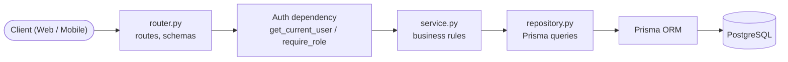
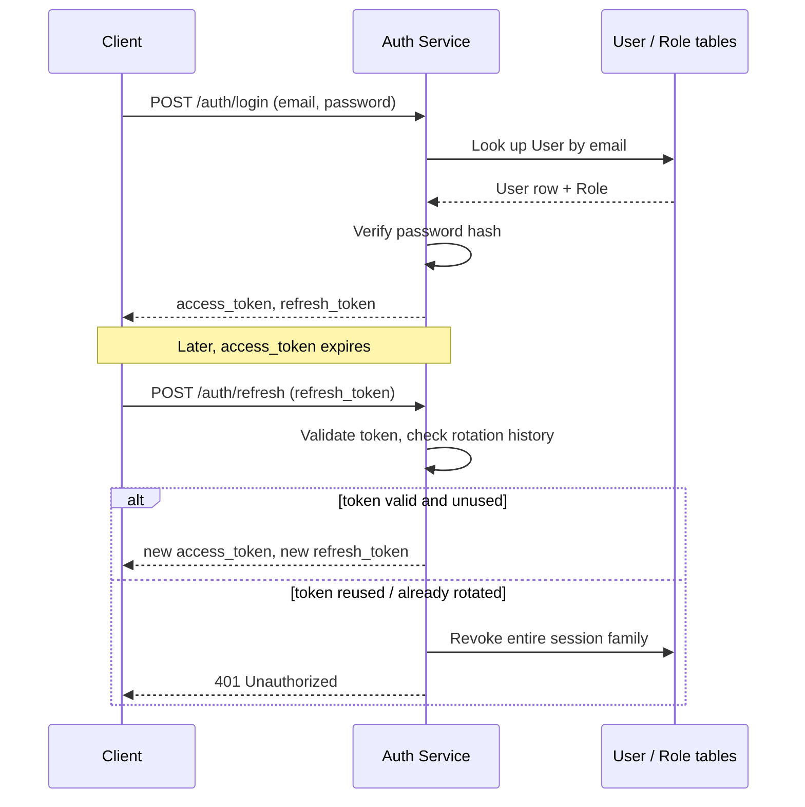
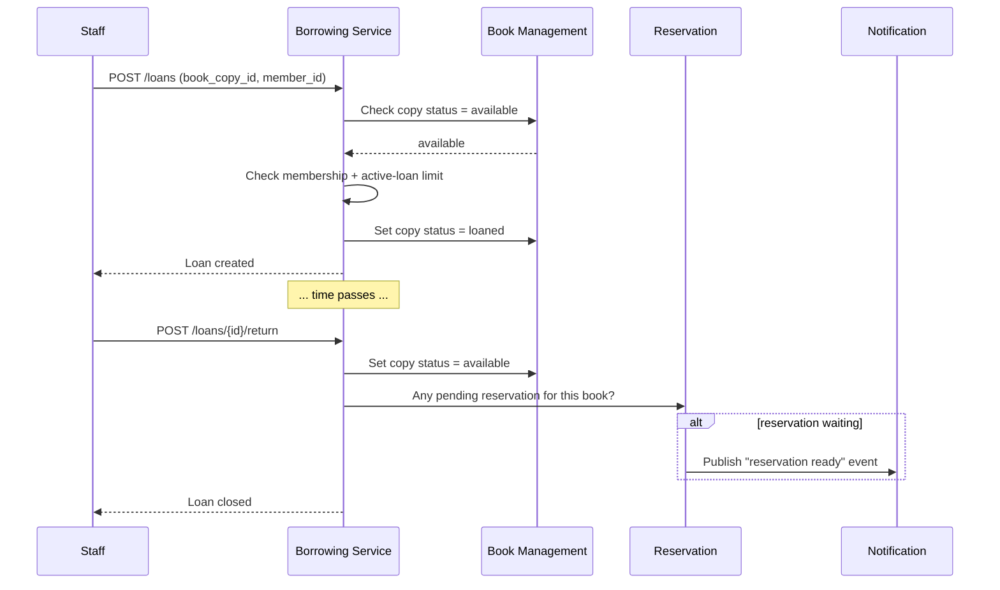
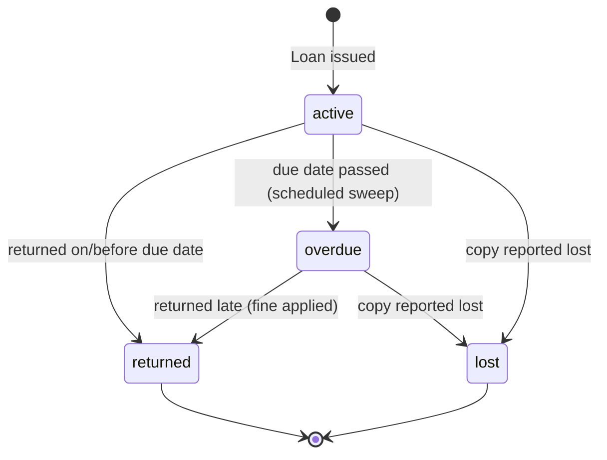
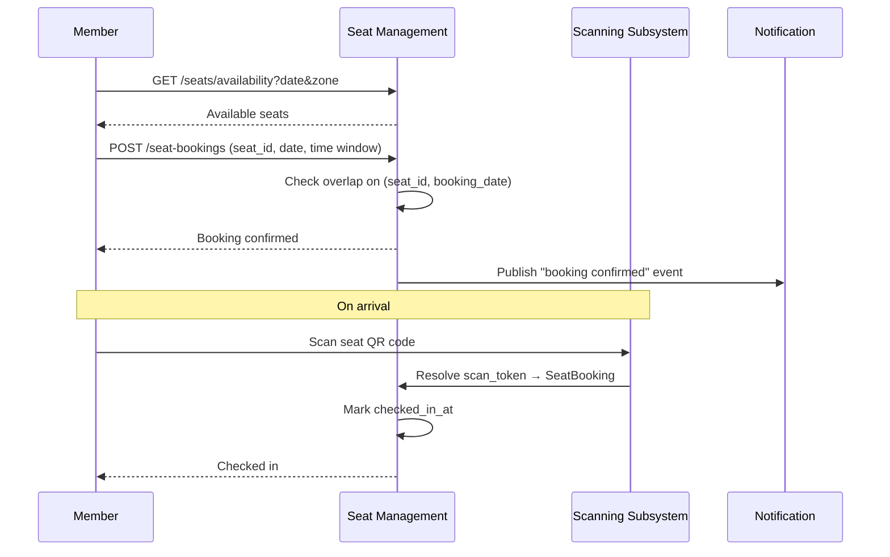
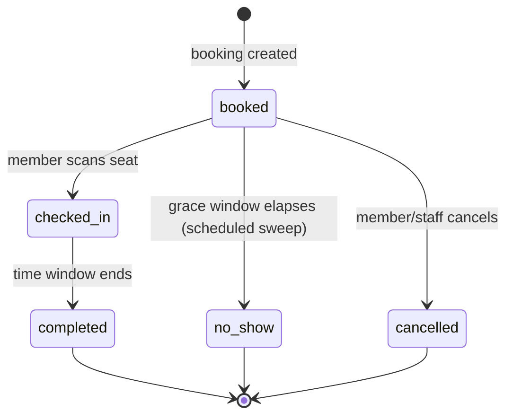
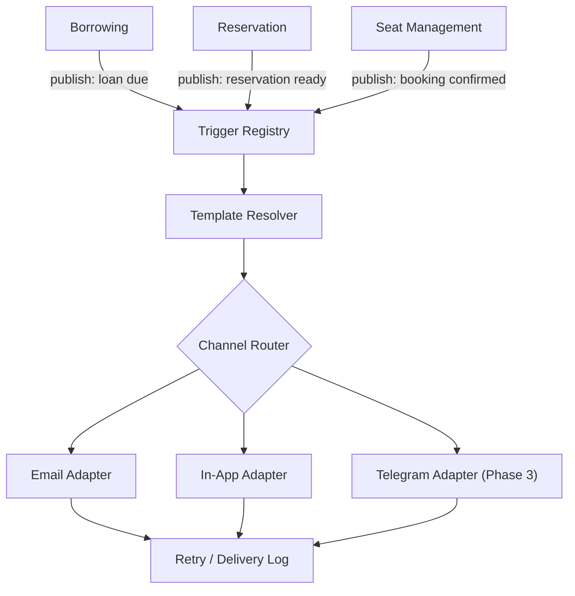
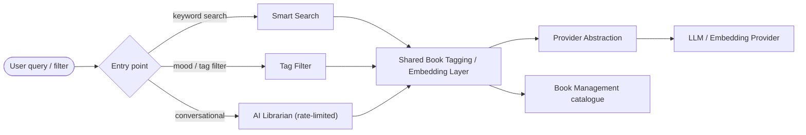
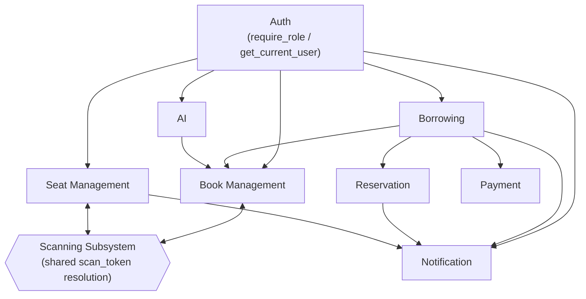

# Community Reading Club & Library Management Platform
## System Components — Component Design Document (M2-06)

This document describes the major backend components of the platform: what each one owns, what it is responsible for, what it exposes to the rest of the system, and how it relates to its neighbors. It covers the six components requested for M2-06 — Auth, Book Management, Borrowing, Seat Management, Notifications, and AI — together with enough of their neighboring components (Membership, Payment, Reservation, Scanning) to make the boundaries clear, since none of these six operate in isolation.

It builds directly on two documents already in this repository and does not redefine anything they have already settled:

- [`PROJECT_SPECIFICATION.md`](./PROJECT_SPECIFICATION.md) fixes the layering (Section 7: FastAPI Routers → Application Services → Repositories → Prisma ORM → PostgreSQL), the module list (Section 11), and the API style (Section 12: REST, `/api/v1`, JWT-protected, versioned).
- [`Database_Design.md`](./Database_Design.md) fixes the twelve-table core schema that every component below reads or writes.
- [`Project_Specification_V2.md`](./Project_Specification_V2.md) fixed a set of architectural consolidations (Section 1) ahead of Milestone 3. The most significant of these for this document is that Notifications and AI are not thin features bolted onto other modules — they are standalone services that other components publish to or query. That decision shapes Sections 5 and 6 below more than anything else in this document.

Phase labels used below — Core MVP, Important (Phase 2), Advanced (Phase 3), Future Scope (Phase 4+) — match the categorization already agreed in `Project_Specification_V2.md`, Section 4. A phase label next to a responsibility means "this is designed for now, but not necessarily built in the first pass of Milestone 3."

### Module Layout

Each component will live under `backend/src/app/modules/<name>/` (target layout), split the same way regardless of size:

| File | Contains | Does not contain |
|---|---|---|
| `router.py` | FastAPI route declarations, Pydantic request/response schemas, dependency wiring (`Depends(require_role(...))`) | Business logic, Prisma calls |
| `service.py` | Business rules, validation, orchestration across repositories | Route decorators, raw SQL/Prisma queries |
| `repository.py` | Prisma Client Python queries for this module's tables only | Business rules, cross-module calls |

No component's repository queries another component's tables directly; cross-component data needs go through that component's service layer. This rule is assumed throughout the rest of this document and is not repeated in each section.

### Request Flow Through the Layers

Every router in every component below passes through the Auth dependency before reaching its own service layer; this arrow is omitted from the per-component diagrams that follow to avoid repeating it six times.

---

## Step 1 — Auth Component

**Owns:** `User`, `Role`. Everything about proving who is calling and what they are permitted to do.

### Responsibilities

| Capability | Notes |
|---|---|
| Register | Email and password; password hashed with bcrypt, never stored or logged in plaintext. |
| Login | Validates credentials, issues an access and refresh token pair. |
| Forgot / reset password | Time-limited reset token delivered by the Notification component — Auth does not send email itself. |
| JWT issuance | Short-lived access token (minutes), longer-lived refresh token (days). |
| Refresh token rotation | Every refresh issues a new refresh token and invalidates the old one. Reuse of an already-rotated token is treated as a compromise signal and revokes the entire session family. |
| Role-based access control | Role is a row (`admin` / `staff` / `member`) on `User.role_id`, not a hardcoded enum, so adding a role later is a data change, not a deployment. |

### Login and Token Refresh Flow

### Key Endpoints

| Method | Path | Auth | Description |
|---|---|---|---|
| POST | `/api/v1/auth/register` | Public | Create a member account. |
| POST | `/api/v1/auth/login` | Public | Returns access and refresh tokens. |
| POST | `/api/v1/auth/refresh` | Refresh token | Rotates and returns a new pair. |
| POST | `/api/v1/auth/forgot-password` | Public | Triggers a reset-token email via Notification. |
| POST | `/api/v1/auth/reset-password` | Reset token | Sets a new password. |
| GET | `/api/v1/auth/me` | Access token | Returns the caller's own profile and role. |

### Boundary

Auth answers "who is this, and what role do they hold." It does not decide feature-level permissions such as "can this staff member waive a fine" or "can this member book a third seat" — those are business rules owned by the relevant component (Borrowing, Seat Management), which asks Auth for the caller's identity and role and then applies its own policy. This keeps Auth free of any knowledge of fines, seats, or loans.

### Interfaces Consumed by Other Components

- `get_current_user()` — FastAPI dependency, decodes the JWT once per request and returns the `User` row.
- `require_role("staff", "admin")` — FastAPI dependency, returns 403 if the caller's role is not in the allowed set.

These two functions are the only place a JWT is decoded anywhere in the backend.

**Depends on:** nothing. Auth is the one component every other component depends on, never the reverse.

---

## Step 2 — Book Management Component (Library / Catalogue)

**Owns:** `Book`, `BookCopy`. Title and author/category metadata, individual physical copies, and catalogue search.

### Responsibilities

- CRUD on `Book` records, restricted to staff/admin via `require_role`.
- Copies are modeled independently of titles: one `Book` has many `BookCopy` rows, each tracked separately by `status` (`available` / `loaned` / `reserved` / `written_off`) and `condition` (`good` / `damaged` / `lost`). A title with five copies is not simply "in stock" or "out of stock" — availability is per copy.
- Full-text search (Core MVP) over `title` and `description` using the Postgres GIN index defined in `Database_Design.md`, Section 4, plus structured filters for category, author, and availability.
- Damaged/lost handling: staff mark a copy's condition, the service sets `replacement_cost`, and that cost is handed off to Borrowing to bill as a fine. Book Management never writes to `Payment` itself.
- Owns the book side of the unified Scanning Subsystem (Important, Phase 2): `BookCopy.scan_token` is resolved by one shared scan-resolution endpoint that inspects the token and routes to either Book Management or Seat Management, so staff use one scanning implementation for both books and seats.

### Copy Lifecycle

```mermaid
stateDiagram-v2
    [*] --> available: copy added
    available --> loaned: Loan issued
    loaned --> available: Loan returned (copy becomes available; condition may change)
    loaned --> written_off: returned + replacement billed (lost/damaged)
    available --> written_off: staff write-off
    written_off --> [*]
```

### Key Endpoints

| Method | Path | Auth | Description |
|---|---|---|---|
| GET | `/api/v1/books` | Public | List/search/filter books. |
| GET | `/api/v1/books/{book_id}` | Public | Book detail, including per-copy availability. |
| POST | `/api/v1/books` | staff/admin | Create a book record. |
| PATCH | `/api/v1/books/{book_id}` | staff/admin | Update metadata. |
| DELETE | `/api/v1/books/{book_id}` | admin | Soft delete (`deleted_at`) — never a hard delete, so existing `Loan`/`Review` rows remain valid. |
| POST | `/api/v1/books/{book_id}/copies` | staff/admin | Add a physical copy. |
| PATCH | `/api/v1/books/copies/{copy_id}` | staff/admin | Update condition/status (e.g. mark damaged). |

**Depends on:** Auth (role checks on every mutating route).

**Depended on by:** Borrowing (needs an available `BookCopy` to issue against), Reservation (queues against `Book`, not a specific copy), AI (reads book metadata to tag and recommend), Scanning Subsystem (resolves a scanned token to a `BookCopy`).

---

## Step 3 — Borrowing Component

**Owns:** `Loan`. Issue, return, renew, fine calculation, and borrow history — the most heavily connected component in the system, since most other modules eventually need to know whether a given book is currently out, and to whom.

### Responsibilities

| Operation | What the service checks or does |
|---|---|
| Issue | `Membership` is active and under `MembershipPlan.max_active_loans`; a `BookCopy` for the requested `Book` is `available`; creates the `Loan`; flips the copy to `loaned`. |
| Return | Sets `Loan.returned_at`; flips the copy back to `available` (or `written_off` if condition changed at return); notifies Reservation so the next member in that book's queue can be promoted. |
| Renew | Extends `due_at` only if no one else has reserved the book and `renewed_count` is under the configured limit; otherwise rejected with an explicit reason rather than a silent no-op. |
| Fine calculation | Core MVP, with grace period, per-day rate, cap, and per-category overrides held as configuration rather than code, so a policy change does not require a deployment. Fines settle through the shared `Payment` table (`type = 'fine'`), which Borrowing writes to but does not own. |
| Overdue sweep | Core MVP. A scheduled background job walks `Loan` rows past `due_at`, flips them to `overdue`, and accrues the fine. This runs on a schedule, never synchronously inside a user request. |

### Issue / Return Flow

### Loan Status Lifecycle

### Key Endpoints

| Method | Path | Auth | Description |
|---|---|---|---|
| POST | `/api/v1/loans` | staff/admin | Issue a loan (by `book_copy_id` or scanned token, and `member_id`). |
| POST | `/api/v1/loans/{loan_id}/return` | staff/admin | Return a copy. |
| POST | `/api/v1/loans/{loan_id}/renew` | member (self) / staff | Renew if eligible. |
| GET | `/api/v1/loans` | member (own) / staff (any) | Borrow history, filterable by member and status. |
| GET | `/api/v1/loans/{loan_id}` | member (own) / staff | Loan detail, including current fine if any. |

**Depends on:** Book Management (copy availability/state), Auth (`issued_by` staff identity, role checks), Reservation (queue promotion on return), Notification (due-soon / overdue alerts), Payment (fine settlement — a thin, single-table component with no independent business rules beyond what Borrowing and Membership drive into it, so it is not broken out as its own section here).

**Depended on by:** Analytics (overdue counts, popular-books ranking), Notification (reads due-date/fine state to decide what to send).

---

## Step 4 — Seat Management Component

**Owns:** `Seat`, `SeatBooking`. Live availability, date/time-slot booking, check-in, and booking history.

### Responsibilities

- Day-level seat reservation is Core MVP; live per-zone availability and a seat occupancy dashboard are Important (Phase 2), sequenced after a caching layer is introduced.
- Availability is computed by querying `SeatBooking` against the requested date/time window. This is a read-heavy, low-write, latency-sensitive path, read far more often than the underlying data changes, and is the first component flagged for a Redis cache in front of PostgreSQL rather than querying the live table on every page load.
- A new `SeatBooking` is accepted only if it does not overlap an existing booking for that `seat_id`, checked at the service layer against the `(seat_id, booking_date)` composite index defined in `Database_Design.md`, Section 4.
- Check-in uses the same `scan_token` mechanism as Book Management (`Seat.scan_token`), resolved through the shared Scanning Subsystem rather than a second, seat-specific implementation. (Important, Phase 2.)
- No-show handling: a booking not checked into within its grace window flips to `no_show` and frees the seat, using the same scheduled-job pattern as Borrowing's overdue sweep — nothing time-based is computed synchronously on a request.

### Booking and Check-in Flow

### Booking Status Lifecycle

### Key Endpoints

| Method | Path | Auth | Description |
|---|---|---|---|
| GET | `/api/v1/seats` | member | List seats/zones. |
| GET | `/api/v1/seats/availability` | member | Availability for a given date and zone. |
| POST | `/api/v1/seat-bookings` | member | Book a seat for a date/time window. |
| POST | `/api/v1/seat-bookings/{booking_id}/check-in` | member/staff | Check in via scanned token. |
| POST | `/api/v1/seat-bookings/{booking_id}/cancel` | member (own) / staff | Cancel a booking. |
| GET | `/api/v1/seat-bookings` | member (own) / staff (any) | Booking history. |

**Depends on:** Auth (role checks for zone/seat administration), Scanning Subsystem (shared with Book Management).

**Depended on by:** Notification (booking confirmations/reminders), Analytics (occupancy dashboard, fed from pre-aggregated snapshots rather than live queries).

---

## Step 5 — Notification Component

**Owns:** no table in the current twelve-table core schema, and that omission is deliberate rather than an oversight. `Project_Specification_V2.md`, Section 1, identified the original feature list — "Reservation Notification," "Email Notifications," "Telegram Notifications," an admin "Configure Notifications" screen — as four labels for a single subsystem, and noted that building them separately would mean every future feature that needs to notify a user re-implements delivery, retries, and preferences independently. Notification is therefore modeled as a cross-cutting service: other components publish events to it, and it owns delivery.

### Responsibilities

| Piece | Behavior |
|---|---|
| Trigger registry | Borrowing, Reservation, and Seat Management publish named events (loan due, reservation ready, seat booking confirmed) instead of each formatting and sending its own message. |
| Channel abstraction | Email ships first (Core MVP), alongside in-app notifications. Telegram is added later as a second channel behind the same interface (Advanced, Phase 3) — adding a channel means implementing one adapter, not modifying every feature that sends notifications. |
| Delivery | Retry-on-failure and, once user preferences exist, per-channel per-event opt-in/opt-out live here once, rather than being duplicated in each calling feature. |

### Publish / Delivery Flow

### Key Endpoints

| Method | Path | Auth | Description |
|---|---|---|---|
| GET | `/api/v1/notifications` | member (self) | List the caller's in-app notifications. |
| PATCH | `/api/v1/notifications/{id}/read` | member (self) | Mark a notification read. |
| GET | `/api/v1/notifications/preferences` | member (self) | Channel opt-in/opt-out (Phase 2). |
| PATCH | `/api/v1/notifications/preferences` | member (self) | Update preferences (Phase 2). |

There is no `POST /notifications` exposed to end users. Notifications are created only internally, by another component calling this service's publish function, never by a direct client request.

**Depends on:** Auth (reads `User` contact information for delivery). Otherwise nothing — it is a sink other components write to, not a component that reaches out to pull state from them.

**Depended on by:** Borrowing (due/overdue/fine alerts), Reservation (book-ready alerts), Seat Management (booking confirmations), Community (discussion replies, once that module exists — Advanced, Phase 3).

---

## Step 6 — AI Component

**Owns:** no table of its own; sits behind a provider abstraction, per `PROJECT_SPECIFICATION.md`, Section 14 ("use an abstraction layer so AI providers can be changed later"). It also consolidates what the original feature list described as two separate items — "AI Librarian" and "Mood-Based Recommendations" — into a single recommendation service with two entry points, per `Project_Specification_V2.md`, Section 1, because both need to query the same book-tagging/embedding layer or they will drift out of sync with each other (a book tagged "calm" should surface both from a mood filter and from a conversational query for "something relaxing").

### Responsibilities

| Entry point | Phase | Notes |
|---|---|---|
| Smart search | Core MVP / Advanced | The front-end search bar calls this component first; it augments, and never replaces, Book Management's plain full-text search, so results never regress below what a keyword search alone would return. |
| Tag/mood filter | Advanced (Phase 3) | Ships ahead of the conversational entry point — no LLM required, just tag-based filtering over the same book metadata. A cheaper stepping stone toward the conversational assistant. |
| Conversational AI Librarian | Future Scope (Phase 4+) | LLM-backed; deferred past MVP as high cost/complexity relative to MVP value, and the one entry point that requires dedicated rate limiting (below). |

- Provider-agnostic by construction: the LLM/embedding vendor sits behind an interface this component calls internally, so a future provider change touches this module only, not Borrowing, Book Management, or anything downstream.
- Rate-limited specifically at this component's boundary, and only this one — the conversational entry point is the platform's single directly cost-exposed, LLM-billed surface, so throttling belongs here rather than as a blanket API-wide concern that would also slow down inexpensive endpoints.

### Query Routing

### Key Endpoints

| Method | Path | Auth | Phase |
|---|---|---|---|
| GET | `/api/v1/ai/search` | member | Smart search, augments Book Management search. |
| GET | `/api/v1/ai/recommendations` | member | Mood/tag-based recommendations (Phase 3). |
| POST | `/api/v1/ai/librarian/query` | member | Conversational AI Librarian, rate-limited per user (Phase 4+). |

**Depends on:** Book Management (reads book metadata/tags to recommend against and to search over).

**Depended on by:** Frontend recommendation widgets and the global search bar. No backend component depends on AI; it is a leaf in the dependency graph.

---

## Component Dependency Summary

Observations that follow directly from the graph:

- Auth sits underneath every other component and depends on nothing itself; every other component's router imports its dependencies.
- Book Management and Seat Management are peers: each owns exactly one physical resource type (copy, seat) and shares the Scanning Subsystem instead of each implementing its own QR/check-in logic.
- Borrowing is the most connected component: it reads from Book Management, writes events to Notification, and settles fines through Payment, while owning none of those tables itself.
- Notification and AI are the two components with no table in the twelve-table core schema. Both were explicitly consolidated into standalone services in `Project_Specification_V2.md`, Section 1, rather than left as per-feature code scattered across the other modules, and that decision is reflected structurally here, not only in naming.

## Explicitly Out of Scope for M2-06

Membership, Payment, Reservation (as its own detailed section), Community, Donation, and Analytics are real components in this same architecture. They are referenced above only where an in-scope component depends on them — for example, Borrowing depends on Payment for fine settlement, and on Reservation for queue promotion. They were not among the six components requested for M2-06 (Auth, Book Management, Borrowing, Seat Management, Notifications, AI); full write-ups for them can follow the same template (Owns / Responsibilities / Endpoints / Depends on / Depended on by) if and when requested.
