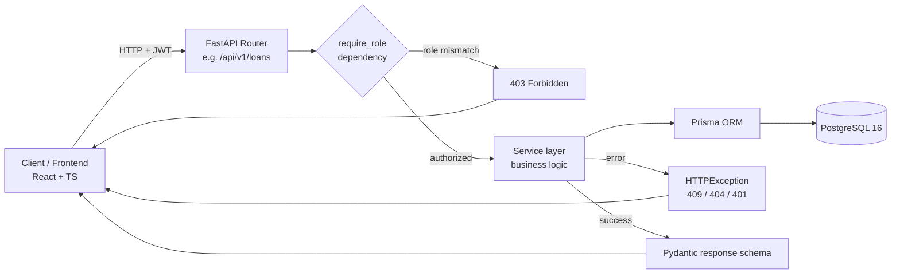
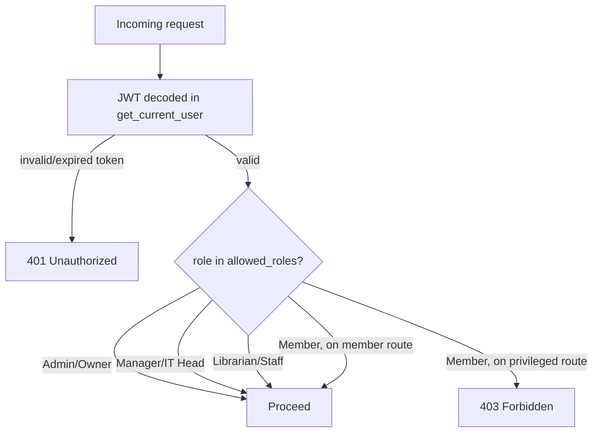
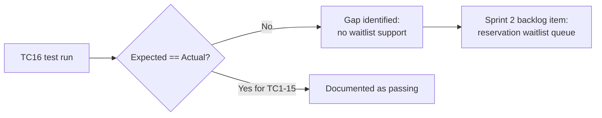

# Milestone 3 Meeting Notes — API & Testing Talking Points

Reference for walking Nidhish/client through **API implementation** and **testing progress**.
Sourced from `SE_Milestone_3_Team_041_May_2026.pdf`, `Team041-Milestone3-Presentation.pptx`, and `milestone3-prez-flow.html` — all three agree on these numbers. Cross-checked against the actual codebase (`backend/src`, `docs/api/openapi.yaml`) on 2026-08-05.

---

## 1. One-breath summary

> "Backend-first Sprint 1: 128 API routes across 27 modules, 348 automated tests (28 files), all core library operations (auth, books, loans, seats, payments, reservations, RBAC) working end-to-end. We wrote 16 representative test cases for the report — 15 passed, 1 failed on purpose-revealing, and that failure directly shaped the Sprint 2 plan (reservation waitlist queue)."

---

## 2. Request → response flow (what to draw if asked "how does an API call work")

Talking point: **every** staff/admin route is wrapped in `require_role()` (`backend/src/app/api/deps.py:66`) — a dependency factory, not a per-endpoint if-check. That's why RBAC is "4/4 done" on the API map: it's structural, not ad hoc.

---

## 3. RBAC — 4 roles, one gate

- `get_current_user` catches `jwt.InvalidTokenError` → clean 401 (was a raw 500 before the Sprint 1 fix).
- `require_role(*roles)` → 403 on mismatch. Applied uniformly across staff/admin routers.

---

## 4. Testing — what actually happened

**Numbers:** 348 test functions, 28 test files, 16 documented in the written report, 15 passed / 1 intentionally-failing.

### 4.1 The 15 that passed (one line each — use as a checklist while presenting)

| # | Test | What it proves |
|---|------|-----------------|
| TC1 | Register user | 201 + JWT + role=member |
| TC2 | Duplicate email | 2nd register → 409 |
| TC3 | Wrong password | 401, no info leak |
| TC4 | Create book (librarian) | 201, fields echoed correctly |
| TC5 | Member creates book → blocked | RBAC 403 (the gate from §3 in action) |
| TC6 | Duplicate ISBN | 2nd create → 409 |
| TC7 | Staff registers walk-in member | 201, password never returned |
| TC8 | Issue a loan | 201, `days_late=0`, `fine_amount=0` |
| TC9 | Overdue fine math | 19-day loan on 14-day period → 5 days late × ₹50 = ₹250, computed correctly |
| TC10 | Return same loan twice | 1st 200, 2nd 409 |
| TC11 | Double-book same seat/date/hour | 1st 201, 2nd 409 (conflict fix from §5) |
| TC12 | Seat availability updates live | booked+1, available−1, total stays 32 |
| TC13 | Record a payment | 201, amount/label/status correct |
| TC14 | `/payments/me` scoping | Member A never sees Admin's payment |
| TC15 | Cancel reservation twice | 1st 204, 2nd 404 |

### 4.2 The one that failed — and why that's a *good* slide

**TC16: Reserve a fully-loaned book.**
- Expected: 201, reservation queued at `queue_position=1`.
- Actual: 409, "no copies available for reservation."
- **Why:** the reservation logic simply blocks when zero copies are free — there's no waitlist concept yet.
- **What we did with it:** documented the gap, didn't paper over it, and it became a named Sprint 2 deliverable (waitlist queue). This is the strongest "we test honestly" evidence in the deck — lead with it if the client pushes on QA rigor.

### 4.3 Beyond the 16 — full suite breadth

28 test files, 348 functions covering: auth (25), books (20), loans (12), seats (19), payments (21), manager (31), admin (29), community (16), reviews (13), events (13), guardian (9), support (19), and more. The 16 in the written report are a curated, representative sample — not the whole picture. If asked "is that really all the testing?", point here.

> **Live re-count (2026-08-05):** the codebase currently has **353 test functions in 29 files** — one file and 5 tests more than the submitted report's 348/28. Per-module counts for every module the report lists (auth, books, loans, seats, payments, manager, admin, community, reviews, events, guardian, support) match exactly; the extra tests are in files the report didn't itemize (e.g. `test_book_records.py`). Work has continued since submission — mention the current number only if asked for "as of today," otherwise the report's 348/28 is what's officially on record.

### 4.4 Nuance on TC16 worth knowing before Q&A

The reservations service already has queue-position/ETA logic (`_queue_info` in `reservations/service.py`) that computes a member's position and estimated wait once a reservation exists. But `create_reservation` still hard-blocks at creation time — `repository.py:48` raises if `count_available_copies(book_id) <= 0` — so you still can't create a reservation on a book with zero free copies today. **TC16 still fails if you run it right now.** So the framing holds ("no waitlist entry on a fully-loaned book"), but if pressed on it, the accurate answer is "the position/ETA math is half-built; what's missing is letting the reservation get created in the first place when copies are 0" — not "nothing exists yet."

---

## 5. Engineering fixes (Sprint 1) — cause → fix → file

| Problem found | Fix | Where |
|---|---|---|
| Seat bookings could double-book a slot | Conflict query before insert, returns 409 | `seat_booking/service.py` |
| Late-return fines weren't calculated | `FINE_PER_DAY = 50` applied and persisted on the loan row | `loans/constants.py`, `loans/service.py` |
| Expired/malformed JWT → 500 crash | Catch `jwt.InvalidTokenError` → clean 401 | `api/deps.py` (`get_current_user`) |
| Any logged-in user could hit admin routes | `require_role()` dependency factory → 403 on mismatch | `api/deps.py:66` |
| Book/member list endpoints returned everything at once | `paginate()` utility (skip/take/order) | `db/pagination.py` |

All five verified present in the current codebase (not just claimed in the report).

---

## 6. User story → API coverage (the "are we done" slide)

**11 of 16 Milestone-1 user stories fully implemented in Sprint 1; 5 deferred to Sprint 2 — but 4 of those 5 already have working backend APIs, just no frontend wiring yet.**

| Role | Done in Sprint 1 | Sprint 2 (backend mostly ready) |
|---|---|---|
| Admin/Owner | Member dashboard, book catalogue CRUD, seat/desk pricing plans | Multi-language (`/translate`), genre/reading trend reports |
| Staff/Manager | Register member, lend+auto-fine, desk allocation, fee receipt | Automated due-date notifications |
| Member | Login+desk availability, borrowing record, reserve books, fee history | Reading profile/goals |
| Guardian | — | Child's membership view |
| System | RBAC (`require_role()` on all staff/admin routes) | — |

---

## 7. Feedback → Sprint 2 (closes the loop)

| Who | Asked for | Already on the Sprint 2 backlog? |
|---|---|---|
| Owner | Ops dashboard (issues/occupancy/fees), payment export | Yes — admin dashboard (10 routes, 29 tests, backend done) |
| Staff | Simple issue/return form, auto reminders | Yes — notifications backend (3 routes, 8 tests, done) |
| Members | Reading history, Hindi/Punjabi, recommendations | Yes — reading progress + `deep-translator` + LangChain/OpenAI, all Sprint 2 |

Message: nothing from user feedback was a surprise scope addition — it maps onto work already in flight.

---

## 8. Sprint 2 backend-ready inventory (already built, just needs frontend + external service wiring)

- Admin dashboard — 10 routes, 29 tests
- Community feed (posts/comments/likes/moderation) — 13 routes, 16 tests
- Events — 9 routes, 13 tests
- Notifications — 3 routes, 8 tests
- Reviews & ratings — 5 routes, 13 tests
- Guardian dashboard — 6 routes, 9 tests
- IT Head (audit logs, support tickets) — 6 routes, 19 tests
- Leaderboard / reading goals / streaks — 16 tests

Remaining Sprint 2 work: LLM (Ollama) hookup for recommendations, `deep-translator` integration, frontend wiring off mock data, reservation waitlist queue, Swagger YAML + pytest run for Sprint 2 endpoints, user testing round.

---

## 9. Timeline (if asked "what's next")

| Window | Sprint | Focus |
|---|---|---|
| Aug 3–7 | Sprint 8 (current) | Events, notifications, reading progress, Recharts dashboard |
| Aug 8–12 | Sprint 9 | LLM integration, reviews UI, language selector, Swagger YAML + pytest for Sprint 2, user testing |
| Aug 13–18 | Sprint 10 | Full frontend integration off live APIs, Playwright + pytest, 70%+ coverage target |
| Aug 19–23 | Sprint 11 | Demo video, final slides, docs, final PDF + zip (Milestone 5) |

---

## 10. Likely questions to be ready for

- **"Why did one test fail — should we be worried?"** → No, it's a scoping gap (no waitlist), not a bug; already scheduled for Sprint 2, and it's proof the test suite catches real gaps instead of rubber-stamping.
- **"Is 128 routes / 348 tests actually all wired to the frontend?"** → No — this milestone was backend-first by design. ~11/16 user stories are frontend-wired now; the rest have working APIs behind mock UI, wiring is explicit Sprint 2/3 scope.
- **"What's the Swagger/OpenAPI status?"** → Sprint 1 YAML was submitted with the report; Sprint 2 API YAML is on the Sprint 9 backlog (`docs/api/openapi.yaml` in-repo currently has ~106 documented paths).
